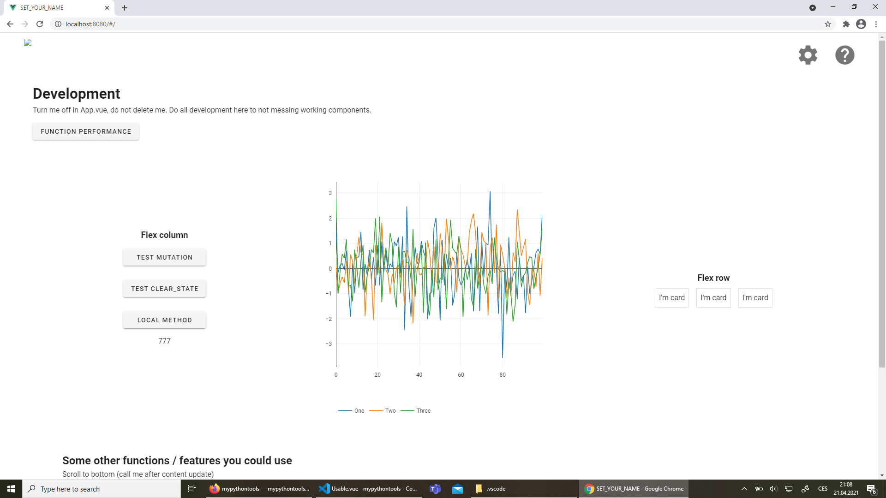

Common functions for Python / Vue / Eel project.

[](https://pypi.python.org/pypi/pyvueeel/) [](https://badge.fury.io/py/pyvueeel) [](https://pepy.tech/project/pyvueeel) [](https://lgtm.com/projects/g/Malachov/pyvueeel/context:python) [](https://pyvueeel.readthedocs.io/en/latest/?badge=latest) [](https://opensource.org/licenses/MIT) [](https://codecov.io/gh/Malachov/pyvueeel)

It contains functions for running eel, overriding eel expose decorator, converting json to correct python format or transform data into form for vue tables and plots.

## Cookiecutter

Try [cookiecutter template](https://github.com/Malachov/project-starter-cookiecutter) for working examples.

## Printscreen

<div align="center"></div>

## Links

Official documentation - [readthedocs](https://pyvueeel.readthedocs.io/)

Official repo - [GitHub](https://github.com/Malachov/pyvueeel)


## Installation

Python >=3.7

Install with

```console
pip install pyvueeel
```

Some functions need extra requirements. If you need such a functionality use

```console
pip install pyvueeel[data]
```

## From scratch tutorial

Here you can find how to implement :doc:`Py/Vue/Eel application<content/pyvueeel-tutorial>`  from scratch.